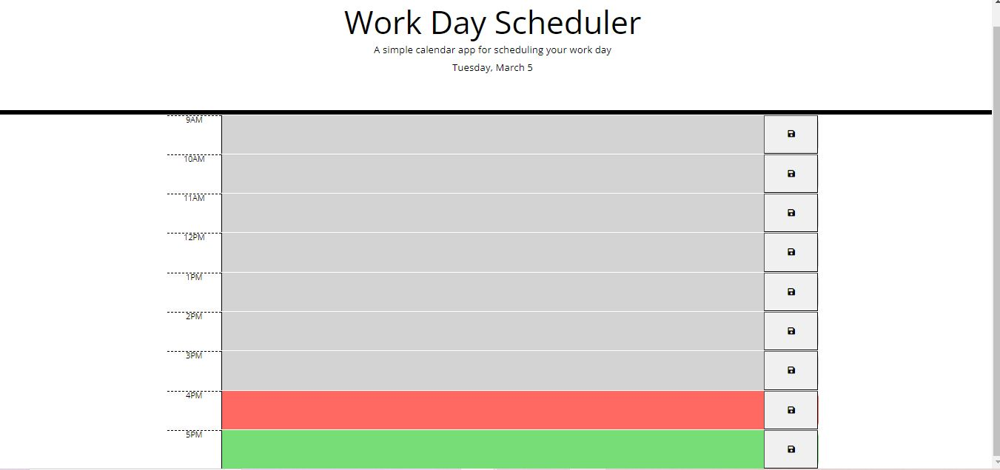

# YourDailyPlanner

## Description

In this project I have created Daily planner that displays the current day at the top of the calendar when a user opens the planner and presents timeblocks for standard business hours when the user scrolls down. It is also color-coded for each timeblock based on past, present, and future when the timeblock is viewed. It allow a user to enter an event when they click a timeblock.

## Table of Contents 

- [Usage](#usage)
- [Installation](#installation)
- [Collaborators](#collaborators)
- [Technologies](#technologies)
- [APIs](#apis)
- [License](#license)

## Usage

#### Access the application on: - 

[Link to deployed page]()

#### The following images show the application's appearance and functionality:

## Installation

#### Clone repository using SSH:
    - Click on the "Code" button and select "SSH"
    - Copy the SSH URL provided
    - In your terminal, navigate to the directory where you want to clone the repository
    - Run the command: git clone <SSH_URL> : replacing <SSH_URL> with the copied SSH URL.

## Collaborators 
This project was made possible by the following contributors:

- Rosemary Benson [Github Link](https://github.com/RoseBenson)

## Technologies 

- HTML
- CSS
- Javascript
- Bootstrap
- jQuery

## APIs 

- [jQuery](https://cdnjs.com/)
- [Day.js](https://www.jsdelivr.com/)

## License

